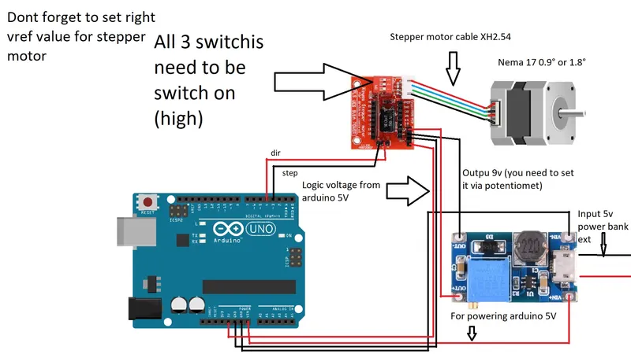

## Wiring schematics

## Choosing parts
You need to main part that is adequate for your latitude. If you live betwen 0°-25° chose : **Main bottom part 0-25 use supports** , 25°-50° use : **Main bottom part 25-50**, 50°-65°+ up use : Main bottom part 45-65.  If you live between 60°-65° you need to use **Main part for laser (14mm) for north 60-65** and **Cover and tightener for north 60-65** because normal parts would not work so north or south.

## Firmware
You need to chose firmware based on your stepper motor. If you have stepper motor which has 400 steps per revolution chose :  firmware simple for Arduino nano 0.9° . If  you have 200 step per rotation stepper motor use : firmware simple for Arduino nano 1.8° . If you want to use different Arduino you might want to change out pins in code.

https://github.com/OndraGejdos/OG-star-tracker-/tree/main/v1/firmware

Or you can use our newly developed pcb to unlock more features. Also you dont need to wire it

https://github.com/OndraGejdos/OG-star-tracker-/tree/main/esp32_wireless_control

### Printing instructions :
Print all parts at 100% infill, except for the following where you can use lower infil:
  ·Large pulley: 50% infill
  ·Ball head holder: 50% infill
  ·Between part: 50% infill
  ·Stationary part: 50% infill
You can use a 0.6mm nozzle for faster printing
Use PLA as the printing material
Parts are oriented in the printing position
Use support only on these specific parts:
  ·Main part: overhang angle 60°
  ·Attachment for slider: overhang angle as specified by your slicer
If you think something is missing, please message me.
Soon, I will upload a bottom main part for those living below 20° latitude.
Clear skies!

3d printed parts chooser : https://docs.google.com/spreadsheets/d/16ynG4nyoBpZOIgJqL5DM0_ZiZSA8s_ifXBTfXa4CrJw/edit?usp=sharing

## Usage guide
You need to first turn it on.

Then you would point laser at polaris.

Then you can point at any celestial object and start shooting.
